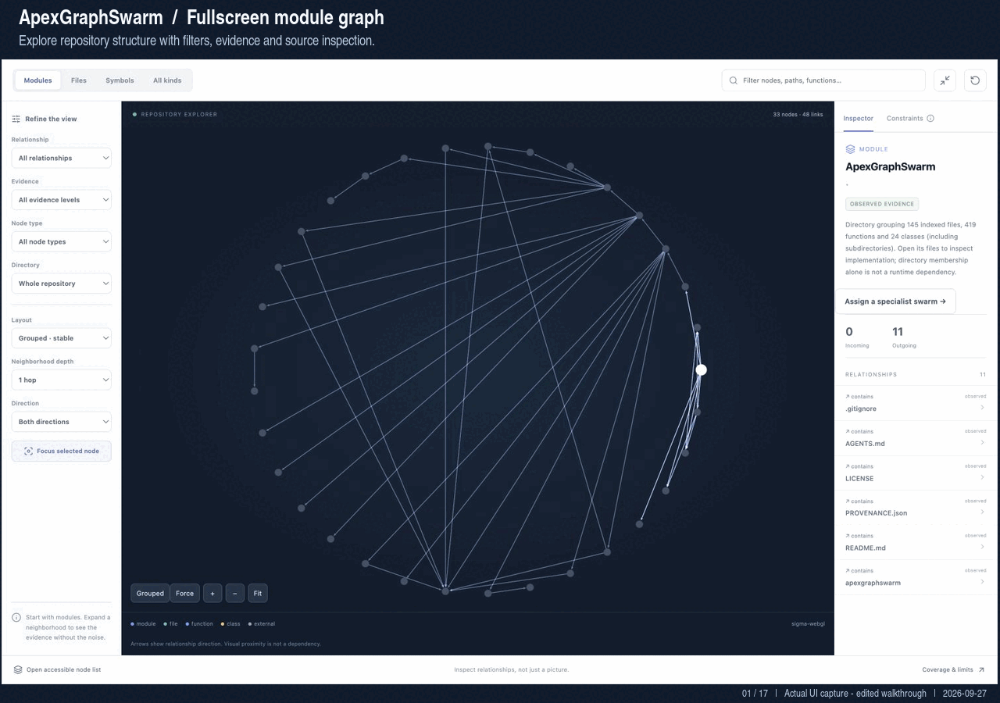
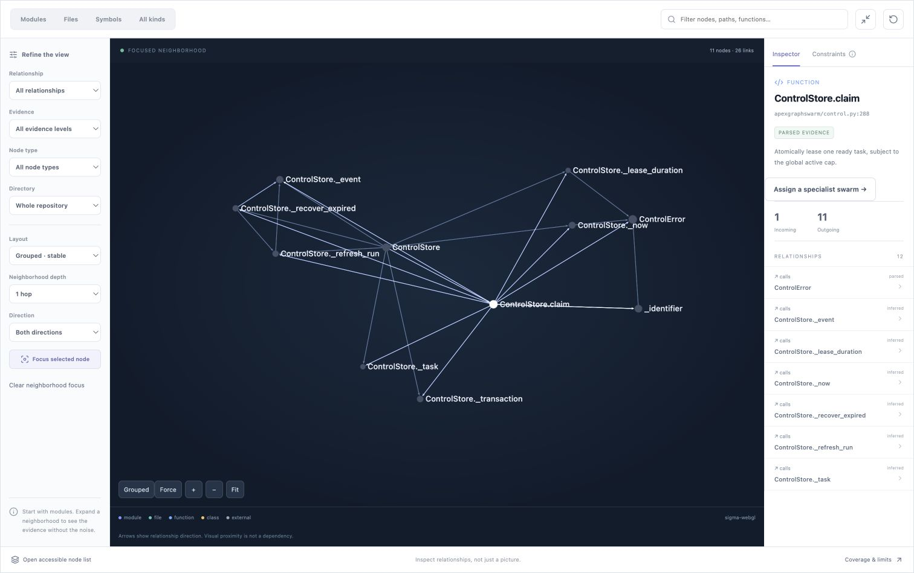
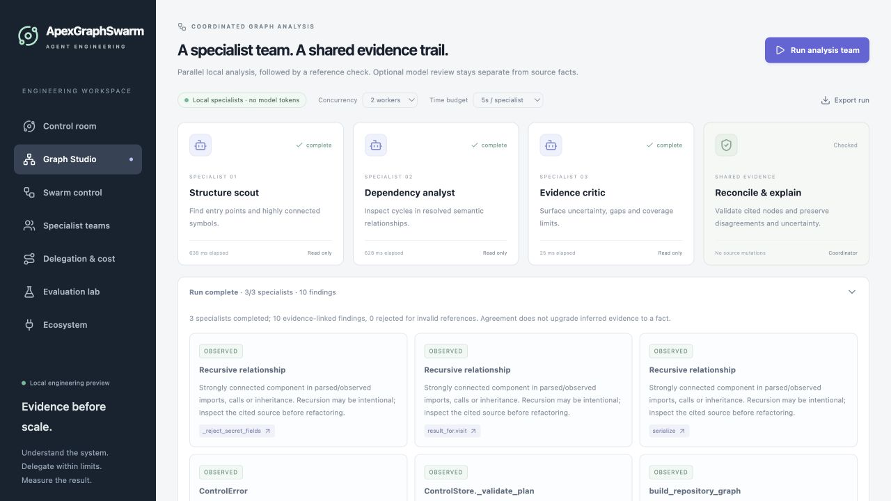
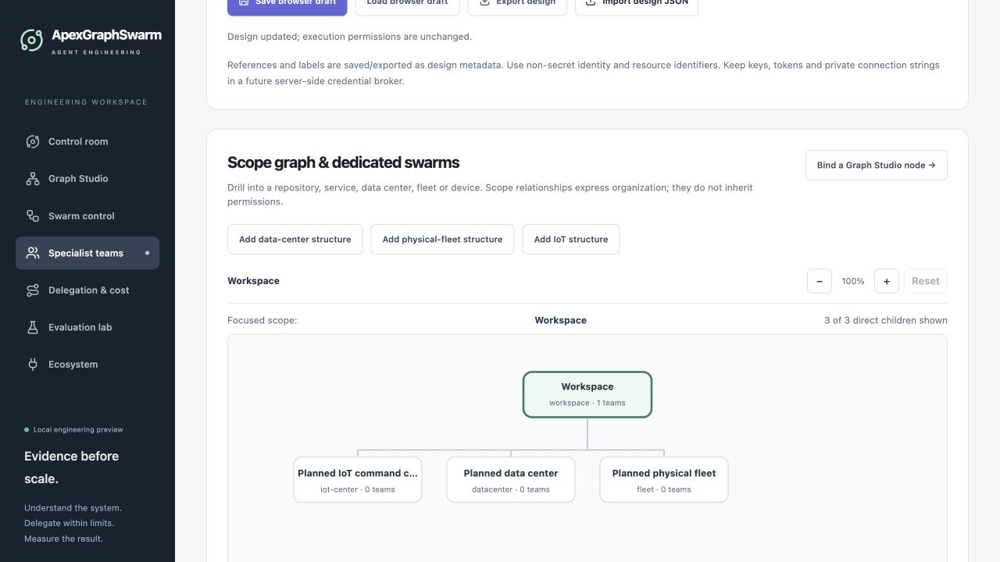
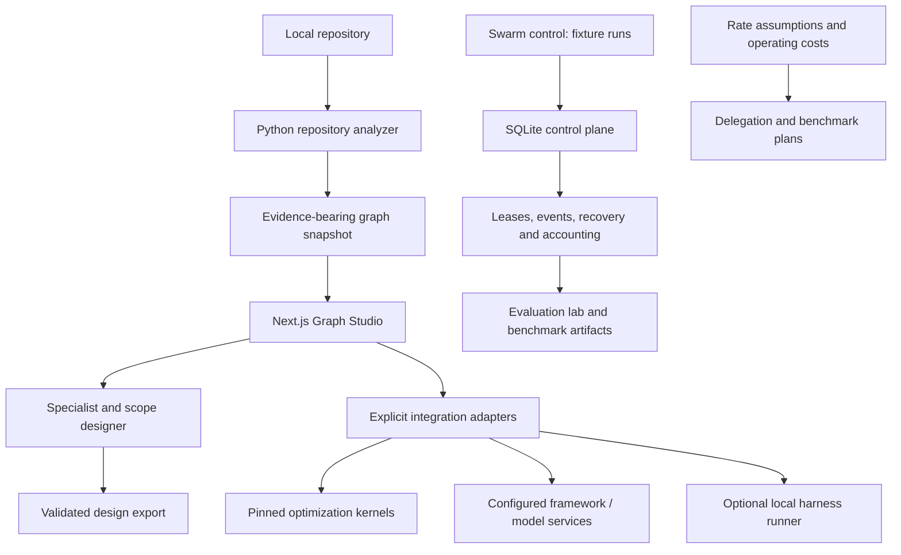

# ApexGraphSwarm

**A local-first engineering workspace for repository intelligence, specialist teams, bounded swarm orchestration, evaluation, and cost-aware delegation.**

ApexGraphSwarm combines an interactive code graph with a durable local scheduling foundation and explicit integration contracts. Explore a repository, design a team with precise capabilities and authority, compare execution and retrieval architectures, and measure what a proposed system can actually do.

ApexGraphSwarm is a standalone engineering platform for building, understanding, and evaluating agentic graph and swarm systems.

> **Status:** local engineering foundation. Repository exploration, deterministic scheduling, design tools, and configured integration adapters are available. Specialist-team designs do not yet dispatch custom teams or enforce IAM/PAM. Data-center, Physical AI, and IoT nodes are planning scopes, not connected infrastructure controllers. See [capabilities and boundaries](#capabilities-and-boundaries).

## Visual walkthrough



**17 actual UI captures · 68-second loop · 1280 × 900 · approximately 1.7 MB.** This is an edited, captioned walkthrough, not real-time execution footage. It covers module/file/symbol views, search, force layout, dependency neighborhoods, evidence and direction filters, constraints, path tracing, local analysis, export/Neo4j controls, integration setup, economics, and specialist scope assignment/drilldown.

[Open the full-resolution screenshot gallery](docs/media/README.md) · [View a static poster](docs/media/walkthrough-poster.png) · [Capture provenance](docs/media/capture-manifest.json)

<details>
<summary>View selected still screenshots</summary>

### Function relationships and source evidence



### Local analysis and cited findings



### Dedicated specialist scopes



The scope examples are unsaved design demonstrations. They do not represent connected infrastructure, live IAM grants, or dispatched custom teams. External framework controls are shown in their actual configuration state; no paid model or remote framework run was performed for these captures.

</details>

## Contents

- [Visual walkthrough](#visual-walkthrough)
- [Quick start](#quick-start)
- [Workspaces](#workspaces)
- [Suggested workflow](#suggested-workflow)
- [Architecture](#architecture)
- [Graph intelligence](#graph-intelligence)
- [Specialist teams and scoped authority](#specialist-teams-and-scoped-authority)
- [Orchestration and integrations](#orchestration-and-integrations)
- [Models, harnesses, and unit economics](#models-harnesses-and-unit-economics)
- [Evaluation and benchmarks](#evaluation-and-benchmarks)
- [Capabilities and boundaries](#capabilities-and-boundaries)
- [Verification and development](#verification-and-development)
- [Deployment and roadmap](#deployment-and-roadmap)
- [Documentation](#documentation)
- [Provenance and licenses](#provenance-and-licenses)

## Quick start

### Requirements

- **Python 3.10+**. The Python control plane uses the standard library only.
- **Node.js and npm** compatible with the pinned Next.js release in [package.json](apps/web/package.json). The web application has its own npm dependencies and lockfile.
- **Git**, including network access if fetching optional kernel sources.

From the repository root:

```sh
npm --prefix apps/web ci
npm --prefix apps/web run dev
```

Open [http://127.0.0.1:3010](http://127.0.0.1:3010). Start with the prepared repository graph, team designer, architecture comparisons, and cost/evaluation planning. Viewing and designing do not require a model API key.

For a local production build:

```sh
npm --prefix apps/web run build
npm --prefix apps/web run start
```

The build prepares the project graph assets. Development and production commands use port **3010** by default. Stop the existing server before starting another on that port.

### Optional original optimization kernels

```sh
python3 scripts/setup_integration_kernels.py --write-env
python3 scripts/setup_integration_kernels.py --check
```

Setup fetches the four pinned public source repositories when absent and adds missing local configuration while preserving existing values. It does not invoke a model. Source pins are recorded in [kernel-sources.json](integrations/kernel-sources.json); downloaded sources are ignored by Git.

Execution controls require the private workspace token configured as `INTEGRATION_ACCESS_TOKEN` in `apps/web/.env.local`. Enter it only in the local execution control that requests it. Keep it out of screenshots, shared exports, and commits. Review [the environment template](apps/web/.env.example) and [integration setup](docs/agent-integrations.md) before enabling services. Provider credentials are separate from this workspace token.

### Analyze another local repository

```sh
python3 -m apexgraphswarm graph /absolute/path/to/repository --output /tmp/repository-graph.json
```

In **Graph Studio**, choose **Import graph** and select the generated JSON. A graph snapshot contains repository metadata and source-derived summaries; review its contents before sharing it.

## Workspaces

| Workspace | Route | Purpose |
| --- | --- | --- |
| Control room | `/` | Entry point for the engineering workspace. |
| Graph Studio | `/graph` | Search, filter, inspect, trace dependencies, use fullscreen, and access configured integrations. |
| Specialist teams | `/teams` | Define specialists, skill/tool bindings, identity policy intent, team membership, and dedicated graph scopes. |
| Swarm control | `/swarm` | Create and observe bounded deterministic task runs backed by the SQLite control plane. |
| Delegation & cost | `/delegation` | Compare model/harness candidates, constraints, editable cost assumptions, and unit economics. |
| Evaluation lab | `/evaluations` | Inspect measured local scheduler results and design held-out evaluations and evolution gates. |
| Ecosystem | `/ecosystem` | Review execution architectures, configured MCP discovery, skills provenance, and operating costs. |
| Architecture lab | `/ecosystem/research` | Compare orchestration, GraphRAG, vector stores, optimization bottlenecks, and benchmark designs. |

## Suggested workflow

1. **Understand the repository.** Inspect modules, files, symbols, source locations, and relationship evidence. Check unresolved references and parser limits before treating a relationship as authoritative.
2. **Define the team.** Open Specialist teams. Give each specialist a precise responsibility, harness/model reference, pinned skills, exact MCP tool bindings, and an accountable owner.
3. **Attach a scope.** Select a Graph Studio node and choose **Assign a specialist swarm**. Attach it beneath the intended scope, then explicitly assign teams. Hierarchy membership does not imply inherited permissions.
4. **Review authority.** Declare exact actions/resources, audience, purpose, short TTL, delegation limit, and approval quorum. Exercise authorization previews and export the validated design.
5. **Plan execution and cost.** Compare orchestration/retrieval candidates, document assumptions, and estimate cost per successful result. Keep unknown usage or prices unresolved.
6. **Evaluate before expansion.** Use deterministic fixtures for control-plane verification. Configure an adapter and a budget before live model work, and use held-out tasks before promoting routing or team changes.

## Architecture



The specialist design export is a contract for future enforcing adapters. It is not automatically connected to the scheduler or framework-job runtime.

```text
apexgraphswarm/              Python graph analyzer, preview utilities, SQLite control plane
apps/web/app/               Next.js workspace routes and API endpoints
apps/web/components/        Graph, team, orchestration, evaluation and cost interfaces
apps/web/lib/               Domain contracts, validation, routing and integration logic
apps/web/integrations/      Web-facing kernel execution bridge
apps/web/public/benchmarks/ Reproducible local benchmark artifacts
integrations/               Pinned kernel manifest and optional local harness runner
scripts/                    Setup and benchmark commands
tests/                      Python regression tests
apps/web/tests/             Web/domain/adapter tests
docs/                       Architecture, contracts, source audits and operating limits
```

## Graph intelligence

Graph Studio supports module/file/symbol views, name/path search, relationship and evidence filters, directory filters, dependency neighborhoods, directed paths, source inspection, grouped layout, background force layout, zoom, and fullscreen. Its SVG overview and accessible node list remain alternatives when WebGL is unavailable. Optional Neo4j storage provides explicit save/load through server configuration; it does not continuously synchronize the graph.

Evidence has a defined scope:

- **Python:** AST declarations, imports, and lexical calls. Dynamic dispatch can remain unresolved.
- **JavaScript/TypeScript:** lexical hints, not compiler-complete semantic resolution.
- **Rust/Go/C++:** file inventory; compiler-backed semantic modules are planned.
- **Directory relationships:** organizational containment, not proof of runtime dependence.

Current bounds include **1,800 visible nodes / 12,000 visible edges**, graph imports up to **25,000 nodes / 100,000 edges / 15 MB**, and default analyzer limits of **2,000 files / 10,000 symbols / 1 MB per source file**. The force-layout worker has a three-second computation budget. These are operating limits, not latency guarantees; narrow dense graphs and inspect truncation warnings.

## Specialist teams and scoped authority

The [team designer](docs/specialist-teams.md) supports:

- Named specialists with precise responsibilities, model/provider references, and harness selection.
- Skill IDs with library/source URL, pinned revision, and SHA-256 reference. A recorded hash is not proof that content was fetched, verified, installed, or trusted.
- Exact MCP server/tool bindings and optional gateway IDs. Selecting a gateway does not grant all tools behind it.
- Reusable teams and explicit team-to-node assignments.
- Per-specialist IAM/PAM intent: identity, accountable owner, tenant, audience, purpose, actions, resources, TTL, delegation depth, and approval quorum.
- Zoomable, searchable scope hierarchies with repository, module, swarm, data-center, rack, fleet, device, and IoT command-center nodes.
- Browser draft persistence and bounded, validated JSON import/export.

The designer permits up to **300 specialists, 64 teams, and 300 scope nodes**, with up to **32 skill and 32 tool bindings per specialist**. Imports are capped at **512 KiB**. The diagram renders a focused node and at most **40 direct children**; the directory provides access to other nodes. These counts describe design capacity, not concurrently running agents.

Authorization previews return `denied`, `approval-required`, or `eligible-for-review`; **execution remains disabled in every case**. Resource assignments are exact, without descendant inheritance. TTL intent is bounded to 1–300 seconds. Approver IDs are simulation inputs, not authenticated approvals. Administrative and physical actuation requests remain denied.

Both original identity projects have pinned source assessments:

- [AAH20/ai-agent-identity-authorization-security](https://github.com/AAH20/ai-agent-identity-authorization-security)
- [AAH20/agent-jit-iam](https://github.com/AAH20/agent-jit-iam)

Their current contracts inform the design, but neither has been installed as a production authorization boundary in this workspace. See [identity findings](docs/specialist-identity-integrations.md) and the [design contract](docs/specialist-design-contract.md) for delegation, approval, persistence, revocation, and receipt limitations.

Future private data-center, Physical AI, and IoT integrations should first map inventory and telemetry to stable asset identities. Commands need separately authenticated enforcement, durable receipts, idempotency, revocation, and independent physical safety controls. The visualization and an LLM orchestration loop are not hard real-time safety controllers.

## Orchestration and integrations

### Durable local control plane

`apexgraphswarm.control.ControlStore` uses SQLite transactions to persist task DAGs, dependency-ready claims, lease tokens, fenced completion, ordered events, recovery state, and integer micro-USD accounting.

Admission rejects invalid/cyclic plans, unknown agents, unknown reservation costs, and budget overcommitment. Ambiguous external completion or spend requires reconciliation instead of automatic replay. Budget overruns are recorded and block further claims; accounting cannot reverse a charge already made by a provider.

The store supports up to **300 logical agents** by default, independently of its database-wide active lease cap. The default active cap is **four**. Swarm control runs deterministic fixtures; the existing framework-job registry has a separate lifecycle and is not made durable by this database.

See [control-plane contracts](docs/control-plane.md) for the Python API, JSON-lines CLI, state machine, retry classes, and reconciliation semantics.

### Original optimization kernels

| Project | Role in ApexGraphSwarm |
| --- | --- |
| [graph-rag-np-hard-kernel](https://github.com/AAH20/graph-rag-np-hard-kernel) | Bounded graph selection and GraphRAG optimization experiments. |
| [agentic-np-hard-kernel](https://github.com/AAH20/agentic-np-hard-kernel) | Agent/task optimization interfaces. |
| [mirofish-swarm-optimizer](https://github.com/AAH20/mirofish-swarm-optimizer) | Swarm/simulation optimization experiments. |
| [agentic-graph-swarm-kernel](https://github.com/AAH20/agentic-graph-swarm-kernel) | Combined graph/swarm solver interfaces. |

The combined suite runs original implementations on a bounded snapshot and reports separate diagnostics and timings. Their objective values are not interchangeable benchmark scores. No universal NP-hard solver, optimality, or superiority claim follows from exposing these adapters. Read the [source audit](docs/integration-source-audit.md), [capability matrix](docs/kernel-capability-matrix.md), and [bottleneck analysis](docs/optimization-bottlenecks.md).

### Frameworks, tools, and skills

- **Configured HTTP/service adapters:** Cognee, MiroFish, LangGraph, CrewAI, and Hermes require their documented service configuration. A successful submission can still require a later status check.
- **Optional local harness profiles:** OpenManus and Understand Anything depend on separately installed applications/plugins and reviewed profiles. Opening an existing Understand Anything viewer does not analyze a repository.
- **Architecture comparisons:** LangChain/DeepAgents, CrewAI, Paperclip, Google AX, complementary GraphRAG pipelines, and vector databases are assessed in the ecosystem documentation. Inclusion in a comparison does not install or benchmark a project.
- **MCP:** discovery supports the documented handshake/HTTP subset and configured server profiles, with bounded responses and explicit compatibility limits. It is not universal support for every MCP transport, protocol revision, gateway, or authentication mode.
- **Skills:** review accepts skill manifests/content for provenance and metadata checks. It does not fetch, install, or execute arbitrary packages from [skills.sh](https://skills.sh) or another library.

## Models, harnesses, and unit economics

The selector includes **Codex, Claude Code, Cursor, Google Antigravity, OpenCode, and Hermes**. Availability in a selector is separate from a verified executable profile. Subscription access uses supported authenticated clients; it is not interchangeable with provider API billing. No supported Antigravity headless runner is assumed.

The optional [local harness runner](docs/local-harness-runner.md) accepts allowlisted profile identifiers and bounded goals. Commands, workspaces, and authentication modes are fixed server-side. It uses a loopback bearer-protected interface, a two-process cap, a 40-second limit, and bounded output. It is not an OS security sandbox. Example profiles start disabled.

**OpenRouter** and **vLLM** inference require configured server-side credentials/endpoints and model IDs. vLLM selection does not provision a GPU. A bounded model review can run independent specialists followed by critic synthesis; this is distinct from arbitrary specialist-team dispatch.

Cost planning exposes token rates, input/output/cache assumptions, fanout, retries, success rate, monthly volume, subscriptions, GPU allocation, fixed operating costs, retrieval/indexing expenses, revenue, and budget constraints. Rates are dated and editable; **unknown costs remain unknown**.

Useful planning relationships are:

```text
API estimate = sum(billable units × applicable rate)
Total operating cost = API + compute + retrieval/storage + tools + allocated fixed costs
Cost per successful result = total operating cost / successful results
Contribution per result = revenue per result − attributable variable cost per result
```

These are estimates until reconciled against actual usage and invoices. A routing plan or cost scenario does not itself change provider routing or execute models. See [cost and routing](docs/apexgraphswarm-cost-routing.md) and [harness billing boundaries](docs/harness-costs.md).

## Evaluation and benchmarks

The checked-in [local scheduler artifact](apps/web/public/benchmarks/local-swarm.json) records its classification, environment, source hashes, seed, configuration, timing, accounting, and recovery checks.

Its largest measured fixture on 2026-09-27 used:

| Measure | Recorded result |
| --- | --- |
| Logical agents | 300 |
| Fixture tasks | 600 |
| Active worker limit / observed peak | 32 / 32 |
| Elapsed time | 6,267.171 ms |
| Duplicate completions | 0 |
| Provider calls / API spend | 0 / $0 |
| Recovery checks | Reopen, recovery completion, and stale-lease fencing recorded |

This measures SQLite orchestration of harmless fixed tasks. It does not measure model intelligence, 300 simultaneous model calls, real infrastructure control, or superiority over another orchestration framework. Results depend on the machine and workload.

To produce a new artifact without overwriting the checked-in baseline:

```sh
python3 scripts/benchmark_swarm.py --help
python3 scripts/benchmark_swarm.py --counts 30 100 300 --workers 32 --output /tmp/apex-swarm-benchmark.json
```

Evaluation plans distinguish task quality, latency, throughput, cost, recovery, and constraints. Configuration evolution should pass held-out quality and budget/latency gates before promotion. Published third-party reports, documented features, proposed tests, and locally measured results have different evidence levels. See [evaluation design](docs/apexgraphswarm-evaluation.md) and [comparison methodology](docs/architecture-comparison.md).

## Capabilities and boundaries

| Area | Available now | Remaining boundary |
| --- | --- | --- |
| Repository graph | Local analysis, snapshot exploration, evidence and limits | Incomplete semantic coverage; no hard real-time latency guarantee |
| Swarm scheduler | Durable local DAGs, leases, recovery and accounting | No distributed worker fleet or multi-tenant authorization |
| Specialist teams | Custom designs, scope assignments, preview, import/export | Custom dispatch and live IAM/PAM enforcement not connected |
| Framework adapters | Explicit configured service/profile operations | External services, credentials and operational verification required |
| MCP / skills | Bounded discovery and review contracts | Not universal interoperability or automatic installation |
| Infrastructure scopes | Data-center, fleet, device and IoT design nodes | Private adapters, authenticated telemetry and command enforcement pending |
| Economics | Editable assumptions and known-cost accounting | Provider invoice reconciliation and unknown-rate resolution required |
| Scale comparisons | Reproducible local fixtures and cited assessments | No 150,000-agent, production-scale, or cross-framework performance claim |

Keep secrets server-side and outside Git. Browser design fields should contain non-secret references, not tokens or connection strings. Imported graphs and skill documents remain untrusted data. Local harness execution inherits the installed tool's permissions; use appropriate isolation for real workloads.

## Verification and development

Run from the repository root:

```sh
python3 -m unittest discover tests
npm --prefix apps/web test
npm --prefix apps/web run typecheck
npm --prefix apps/web run build
```

The specialist-designer verification recorded **31 Python tests and 101 web tests passing**, plus typecheck, production build, and desktop/mobile browser checks. Detailed results and scope are in [verification.md](docs/verification.md). Test timing is machine-dependent; consult the recorded environment and workload when comparing results.

Tests use harmless subprocesses and loopback sockets where required. They do not establish that real provider credentials or separately deployed services work. No paid model run is required for the regression suite.

Read [AGENTS.md](AGENTS.md) before contributing. Keep Python 3.10+ standard-library compatibility, preserve source licenses, bound work and costs, keep unknowns explicit, and add meaningful tests for changed contracts. Frontend changes also require typecheck/build and relevant browser verification. Use Conventional Commits.

## Deployment and roadmap

The supported starting point is a **local, single-workspace deployment bound to loopback**. No one-click Vercel, Cloudflare, or Supabase production deployment is claimed by this repository. A hosted frontend alone cannot safely replace a durable local database, a long-running runner, or private infrastructure connectivity.

Incremental production work includes:

1. **Enforcing specialist execution:** connect validated designs to authenticated workload identities, tenant-aware authorization, JIT credentials, verified approvals, revocation, and auditable adapter receipts.
2. **Durable adapter integration:** unify task lifecycle and remote job status with idempotency, bounded retries, reconciliation, quotas, and isolated workers/worktrees.
3. **Graph scale and fidelity:** incremental ingestion, compiler-backed language semantics, measured layout budgets, and storage-backed graph queries.
4. **Evidence-driven delegation:** live model evaluations on held-out workloads, provider usage capture, rate provenance, and invoice reconciliation.
5. **Private infrastructure adapters:** begin with inventory and telemetry, then add explicitly authorized command capabilities with independent safety controls.
6. **Hosted operation:** select durable storage/queues, secrets management, tenant isolation, recovery, observability, and budget admission before exposing execution endpoints.

Do not place the local SQLite database on an unreliable shared/network filesystem. Framework-job durability, distributed tenancy, and cloud worker provisioning remain separate engineering tasks.

## Documentation

| Topic | Reference |
| --- | --- |
| Architecture and project history | [Architecture notes](docs/apexgraphswarm-extraction.md) |
| Scheduler API and lifecycle | [Control-plane contracts](docs/control-plane.md) |
| Specialist workflow and private adapters | [Team designer](docs/specialist-teams.md) |
| Design schema and preview semantics | [Specialist design contract](docs/specialist-design-contract.md) |
| Identity repository assessment | [IAM/PAM source findings](docs/specialist-identity-integrations.md) |
| Framework/kernel execution | [Integration setup](docs/agent-integrations.md) |
| Kernel evidence and limits | [Source audit](docs/integration-source-audit.md), [capability matrix](docs/kernel-capability-matrix.md) |
| Harness execution and billing | [Local runner](docs/local-harness-runner.md), [billing sources](docs/harness-costs.md) |
| MCP, gateways, and skills | [MCP discovery](docs/mcp-interoperability.md), [skill review](docs/skills-interoperability.md) |
| Ecosystem and AX | [Interoperability](docs/ecosystem-interoperability.md), [Google AX assessment](docs/google-ax-assessment.md) |
| Orchestration and retrieval | [Orchestration landscape](docs/orchestration-landscape.md), [retrieval landscape](docs/retrieval-landscape.md) |
| Bottlenecks and benchmark planning | [Optimization limits](docs/optimization-bottlenecks.md), [comparison plan](docs/architecture-comparison.md) |
| Evaluation and economics | [Evaluation design](docs/apexgraphswarm-evaluation.md), [cost/routing](docs/apexgraphswarm-cost-routing.md) |
| Recorded verification | [Verification results](docs/verification.md) |

## Provenance and licenses

ApexGraphSwarm is licensed under [Apache 2.0](LICENSE). Third-party kernels retain their own licenses and pinned source references; evaluate each dependency's terms before redistribution or commercial use. Inclusion in a catalog is not endorsement, certification, or an implemented integration.

Source provenance is recorded in [PROVENANCE.json](PROVENANCE.json).

For experienced mentorship and implementation discussions: [aah@a2zsoc.com](mailto:aah@a2zsoc.com).
