# ApexGraphSwarm screenshot gallery

Actual browser captures from the local production preview on **2026-09-27**. The repository snapshot contains 145 files, 419 functions and 1,365 relationships. Those counts describe the prepared snapshot, not a fresh live crawl.

[Back to the project README](../../README.md#visual-walkthrough) · [Animated walkthrough](apexgraphswarm-walkthrough.gif) · [Capture manifest](capture-manifest.json)

## Capture and interpretation

- PNG screenshots are unretouched. Native fullscreen and standard workspace views have different source dimensions. The GIF resizes and letterboxes each screenshot and adds separate title/caption bands.
- The GIF contains 17 frames at four seconds each, looping for 68 seconds. It is an edited walkthrough, not a recording of execution speed.
- The source is the public ApexGraphSwarm repository. No private repository contents, credentials, or populated execution-token fields appear.
- Three deterministic local analysis specialists ran successfully. No paid model, remote framework, Neo4j storage operation, or physical command was executed for these captures.
- The infrastructure hierarchy is an unsaved example design created through the UI. Assignment is design metadata; it does not issue privileges or dispatch a team.
- Renderer fallback behavior and unconfigured services are documented in the main README; these screenshots show the active WebGL renderer and the actual setup state.

## Feature index

| View | Feature | Capture |
| --- | --- | --- |

| 01 | Fullscreen module graph | [Full-resolution PNG](screenshots/01-modules.png) |

| 02 | File relationships | [Full-resolution PNG](screenshots/02-files.png) |

| 03 | Functions and classes | [Full-resolution PNG](screenshots/03-symbols.png) |

| 04 | Search and relationship filters | [Full-resolution PNG](screenshots/04-search-calls.png) |

| 05 | Accessible node search | [Full-resolution PNG](screenshots/06-node-search.png) |

| 06 | Inspect a dependency neighborhood | [Full-resolution PNG](screenshots/07-function-neighborhood.png) |

| 07 | Force layout, zoom and fit | [Full-resolution PNG](screenshots/05-force-layout.png) |

| 08 | Evidence and dependency direction | [Full-resolution PNG](screenshots/08-evidence-direction.png) |

| 09 | Explicit graph constraints | [Full-resolution PNG](screenshots/09-constraints.png) |

| 10 | Directed dependency paths | [Full-resolution PNG](screenshots/10-directed-path.png) |

| 11 | Local analysis specialists | [Full-resolution PNG](screenshots/11-local-specialists.png) |

| 12 | Export and optional Neo4j storage | [Full-resolution PNG](screenshots/14-export-storage.png) |

| 13 | Frameworks, kernels and harnesses | [Full-resolution PNG](screenshots/12-integrations.png) |

| 14 | Execution economics | [Full-resolution PNG](screenshots/13-economics.png) |

| 15 | Specialist scope graph | [Full-resolution PNG](screenshots/15-scope-hierarchy.png) |

| 16 | Dedicated teams by scope | [Full-resolution PNG](screenshots/16-scope-assignment.png) |

| 17 | Zoom into a dedicated scope | [Full-resolution PNG](screenshots/17-scope-drilldown.png) |

## 01. Fullscreen module graph

Explore repository structure with filters, evidence and source inspection.

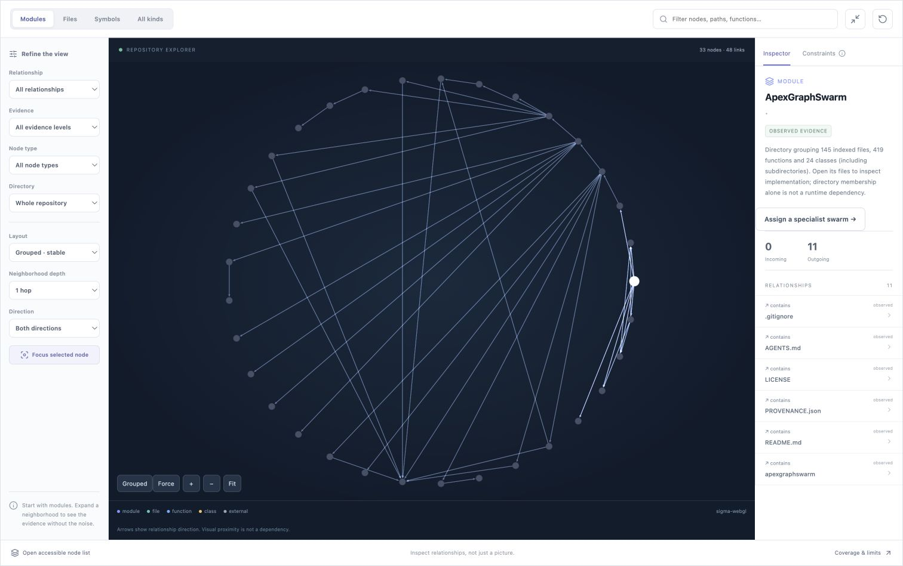

## 02. File relationships

Switch detail levels without losing the repository context.

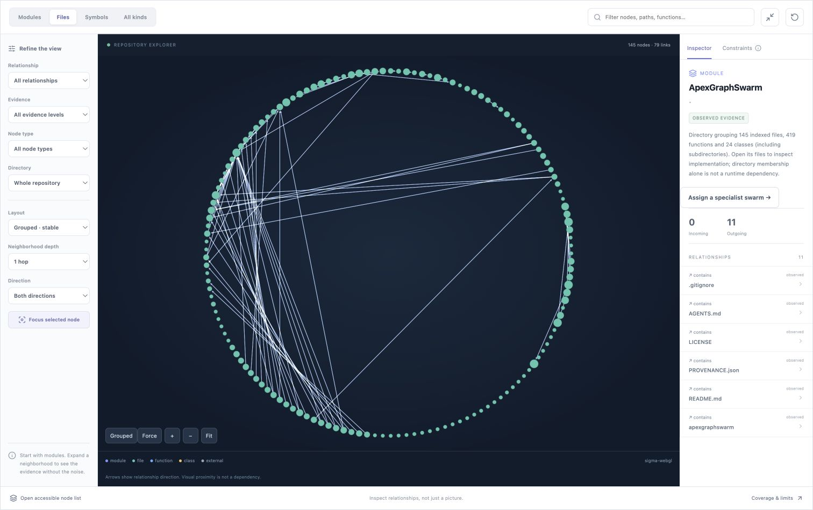

## 03. Functions and classes

Inspect indexed symbols; graph coverage is bounded by the analyzer.

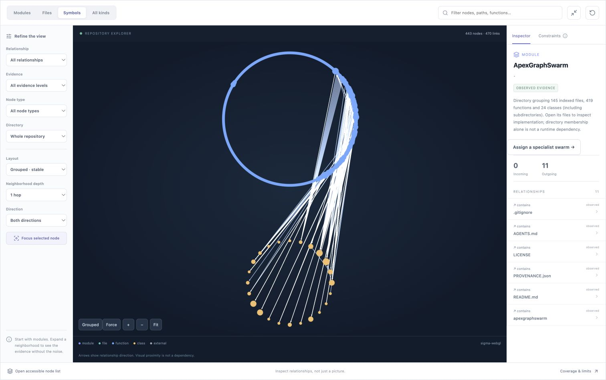

## 04. Search and relationship filters

Narrow the graph to control-related symbols and call relationships.

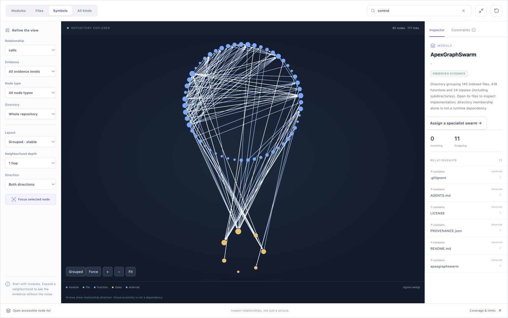

## 05. Accessible node search

Find an exact function through the searchable node list.

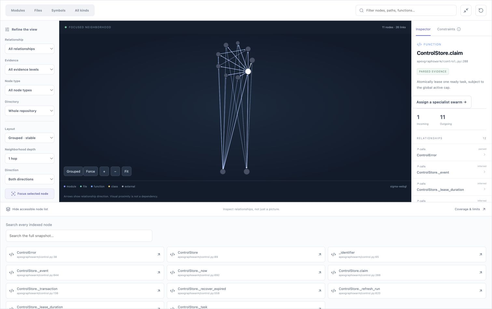

## 06. Inspect a dependency neighborhood

Read the function summary, source location and relationship evidence.

## 07. Force layout, zoom and fit

Inspect a bounded neighborhood using the background layout worker.

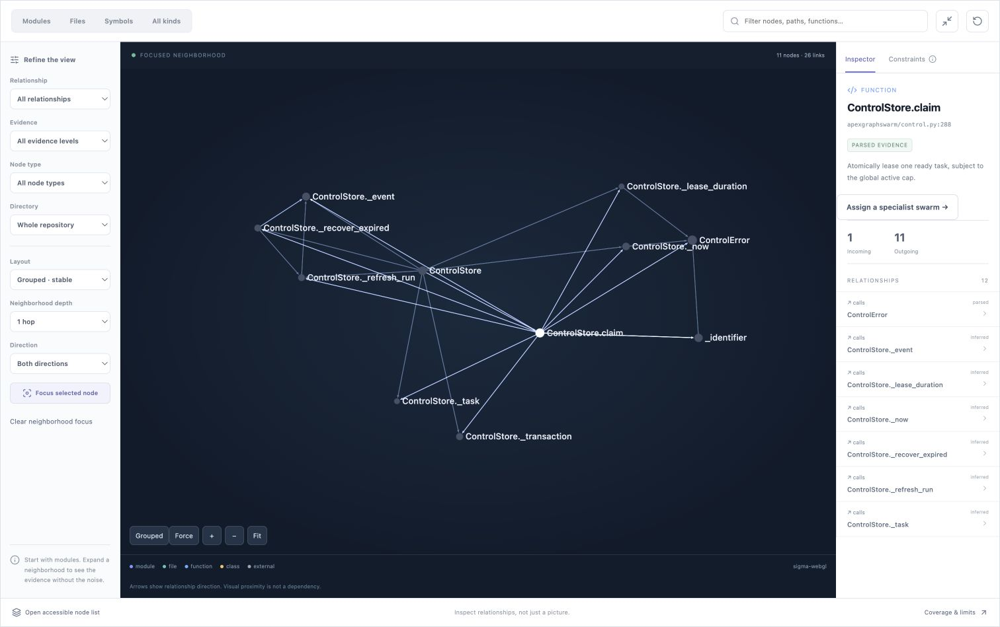

## 08. Evidence and dependency direction

Choose observed evidence, neighborhood depth and incoming dependents.

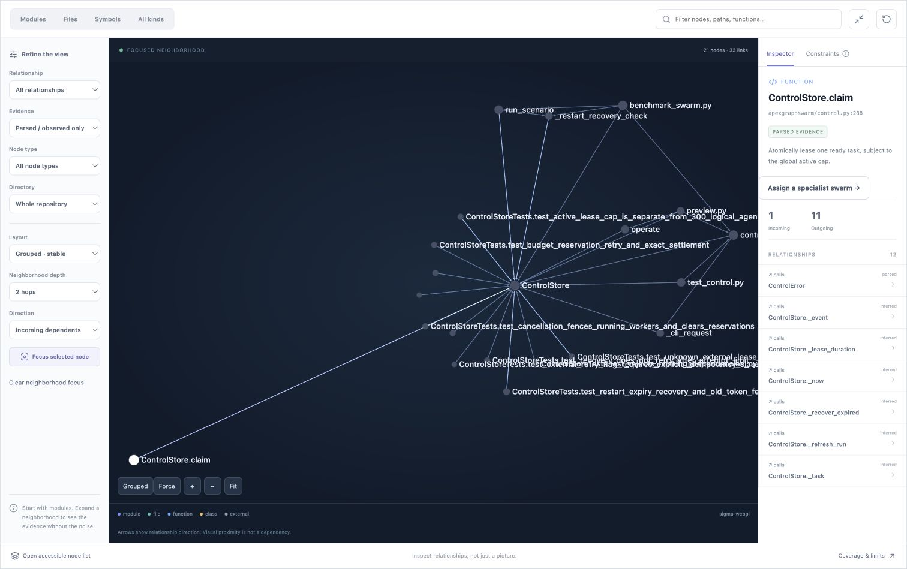

## 09. Explicit graph constraints

Parser coverage, render budgets and unresolved references stay visible.

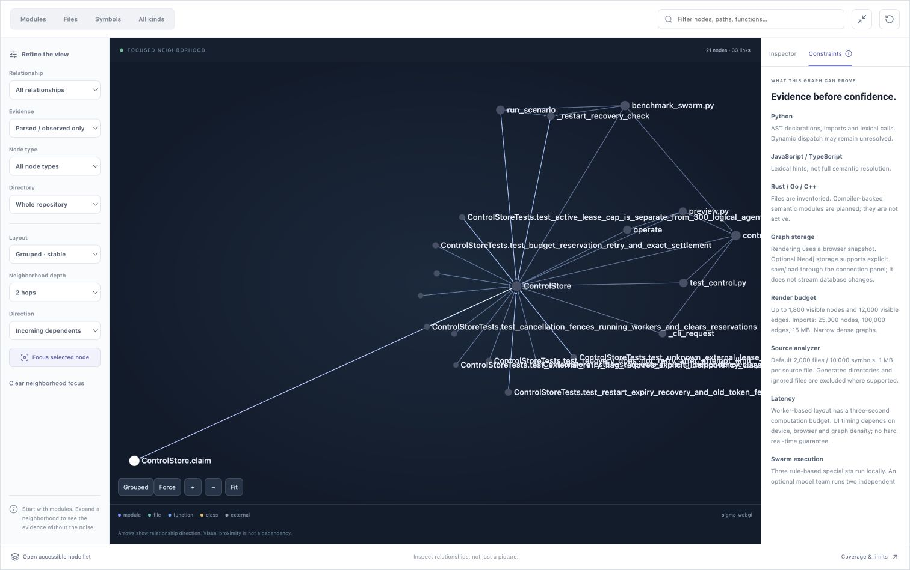

## 10. Directed dependency paths

Trace semantic relationships; inventory edges are excluded.

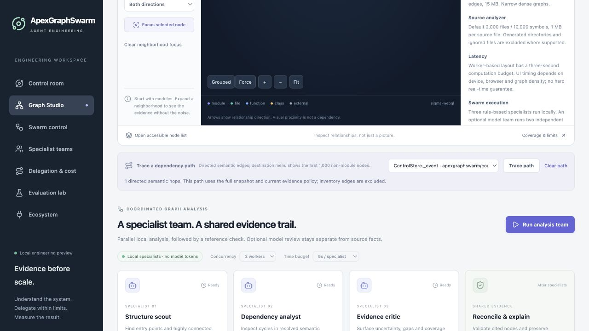

## 11. Local analysis specialists

Three deterministic specialists completed; no model tokens were used.

## 12. Export and optional Neo4j storage

Snapshot and Neo4j bundle exports; database storage requires configuration.

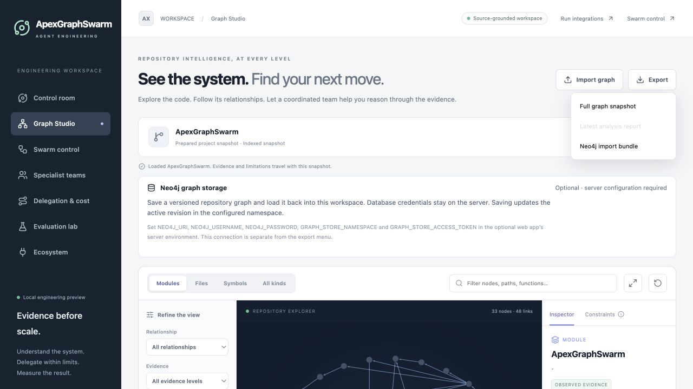

## 13. Frameworks, kernels and harnesses

Configuration UI only: no remote framework or paid model run is shown.

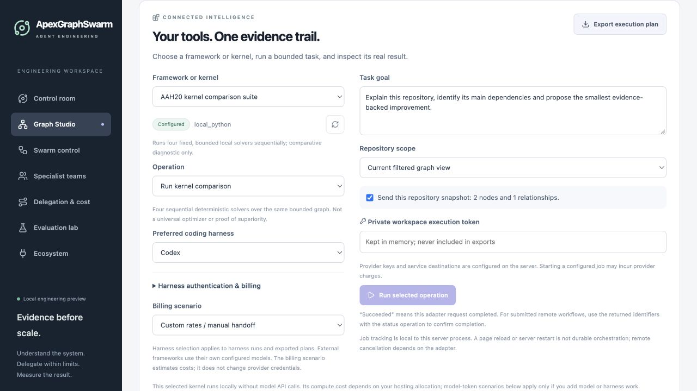

## 14. Execution economics

Editable planning assumptions; unknown costs remain unknown.

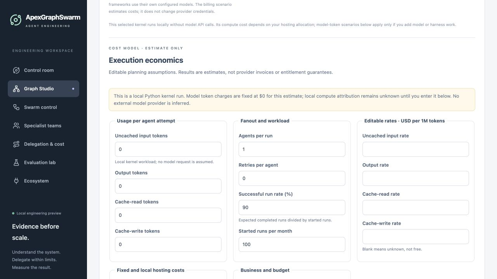

## 15. Specialist scope graph

Example data-center, Physical AI and IoT branches are design-only.

## 16. Dedicated teams by scope

Explicit team assignment does not create a live permission grant.

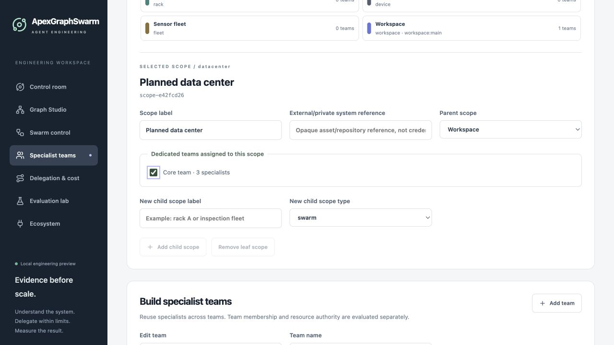

## 17. Zoom into a dedicated scope

Navigate the hierarchy; infrastructure control remains unconnected.

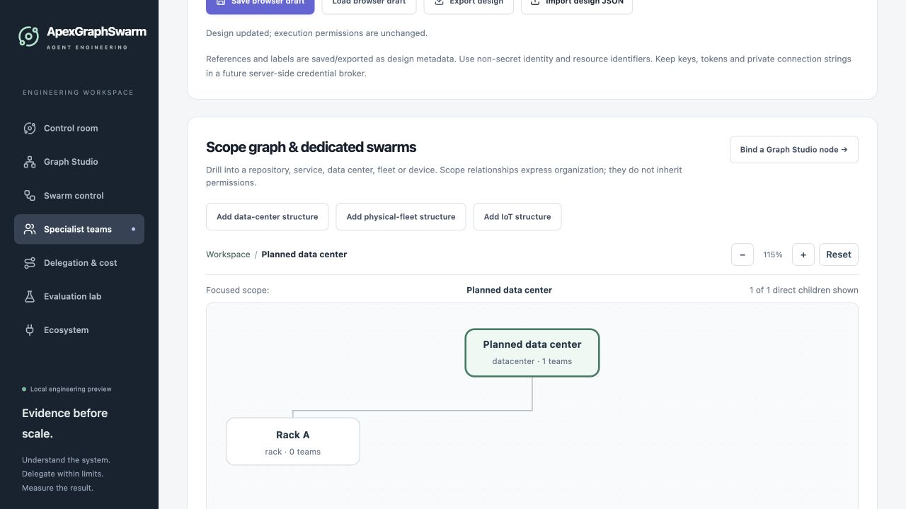
